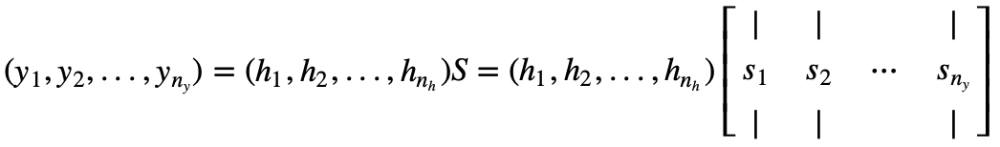

# Numpy Implementation Of NN From Theoretical Perspective

This repository implements a simple two-layer neural network by using pure numpy. To this end, one has to have mastery of the chain rule of derivatives especially in matrix notation. This repository will first elaborate on the derivation from theoretical perspective and give its numpy implementation.

## Prerequisites
Before browsing the derivation, one has to install [Github with MathJax](https://chrome.google.com/webstore/detail/github-with-mathjax/ioemnmodlmafdkllaclgeombjnmnbima) into Chrome. After installation, refresh this page.

## Derivation

Suppose we have a two-layer neural network illustrated as follow.
Then we can obtain its forward pass:

$$h^T=f(u), u^T=x^TW$$
$$y^T=h^TS$$
$$\mathcal{L}=\mathcal{L}(y, t)$$

where $x^T \in R^{B \times n_x}$ is a mini-batch input, $W \in R^{n_x \times n_h}$ and $S \in {R}^{n_h \times n_y}$ are the learning parameters of the network, and $\mathcal{L}$ is the loss function.

Now, the objective is to derive the gradients with respect to $S$ and $W$, respectively. 
Let's first examine $\nabla_S \mathcal{L}$.
By re-writting $y^T=h^TS$, we obtain

$$\begin{equation}
\begin{split}
(y_1, y_2, ..., y_{n_y}) 
& = (h_1, h_2, ..., h_{n_h})S 
& = (h_1, h_2, ..., h_{n_h})
\begin{bmatrix}
| & | &  & |\\
s_1 & s_2 & \cdots & s_{n_y}\\
| & | &  & |\\
\end{bmatrix}
\end{split}
\end{equation}$$

or

$$y_1 = h^Ts_1$$
$$y_2 = h^Ts_2$$
$$\vdots$$
$$y_{n_y} = h^Ts_{n_y}$$

Then, $\frac{\partial\mathcal{L}}{\partial s_i} = \frac{\partial\mathcal{L}}{\partial y_i} \frac{\partial y_i}{\partial s_i} = \frac{\partial\mathcal{L}}{\partial y_i} h$. 
Therefore,
$$\begin{equation}
\nabla_S \mathcal{L} = 
\begin{bmatrix}
| & | &  & |\\
\frac{\partial \mathcal{L}}{\partial s_1} & \frac{\partial \mathcal{L}}{\partial s_2} & \cdots & \frac{\partial \mathcal{L}}{\partial s_{n_y}}\\
| & | &  & |\\
\end{bmatrix} =
\begin{bmatrix}
| & | &  & |\\
\frac{\partial \mathcal{L}}{\partial y_1}h & \frac{\partial \mathcal{L}}{\partial y_2}h & \cdots & \frac{\partial \mathcal{L}}{\partial y_{n_y}}h\\
| & | &  & |\\
\end{bmatrix}
= \left(\frac{\partial\mathcal{L}}{\partial v_i} h_j\right)_{i,j} = h \cdot \frac{\partial \mathcal{L}}{\partial y^T}
\end{equation}$$.

For the greadient wrt $W$, we first determine the gradient wrt $h^T$ and apply the same rule above. Specifically,

$$\nabla_{h^T} \mathcal{L} = \nabla_{y^T} \mathcal{L} \cdot \nabla_{h^T} y = \nabla_{y^T}\mathcal{L} \cdot 
\begin{bmatrix}
— & \nabla_{h^T} y_1 & —\\
— & \nabla_{h^T} y_2 & —\\
 & \vdots & \\
— & \nabla_{h^T} y_{n_y} & —\\
 \end{bmatrix}
= \nabla_{y^T} \mathcal{L} \cdot S$$

Therefore,
$$\nabla_W \mathcal{L} = x \cdot \nabla_{u^T} \mathcal{L}$$
where $\nabla_{u^T} \mathcal{L} = \text{diag}(\nabla f) \cdot \nabla_{h^T} \mathcal{L}$. 
Here, $\nabla f = (\frac {\partial{h_1}}{\partial u_1}, \frac{\partial h_2}{\partial u_2}, \cdots, \frac{\partial h_{n_h}}{\partial u_{n_h}})^T$. 


## Numpy Implementation
```
import numpy

batch_size, n_x, n_h, n_y = 64, 1000, 100, 10

x = np.random.randn(batch_size, n_x)
t = np.random.randn(batch_size, n_y)

W = np.random.randn(n_x, n_h)
S = np.random.randn(n_h, n_y)

learning_rate = 1e-6
for i in range(500):
	# Forward pass: compute predicted y
	u = x.dot(W)
	h = np.maximum(u, 0)
	y = h.dot(S)

	# Compute and print loss
	loss = np.square(y-t).sum()
	print("Iter: {}\tLoss: {}".format(i, loss))

	# Backprop to compute gradients of W and S with respect to loss
	grad_y = 2.0 * (y-t)
	grad_S = h.T.dot(grad_y)

	grad_h = grad_y.dot(S.T)
	grad_u = grad_h.copy()
	grad_u[u<0] = 0
	grad_W = x.T.dot(grad_u)

	# Update weights by gradient descent
	W -= learning_rate * grad_W
	S -= learning_rate * grad_S
```

## Postscript
It's been confusing me. I was thinking that this whole thing involves tensor product. Surprisingly, however, it turns out to be just an application of the fourth definition of matrix product.
